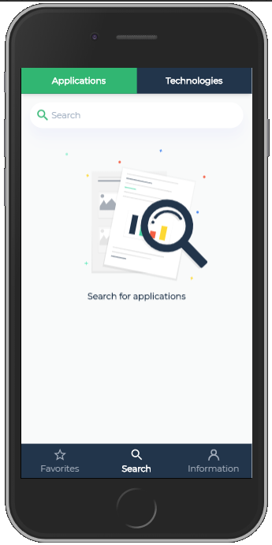
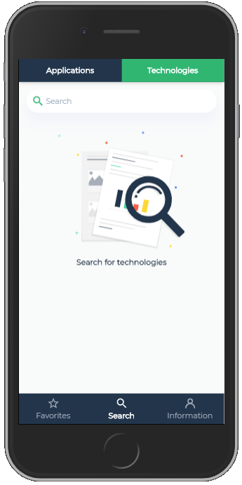
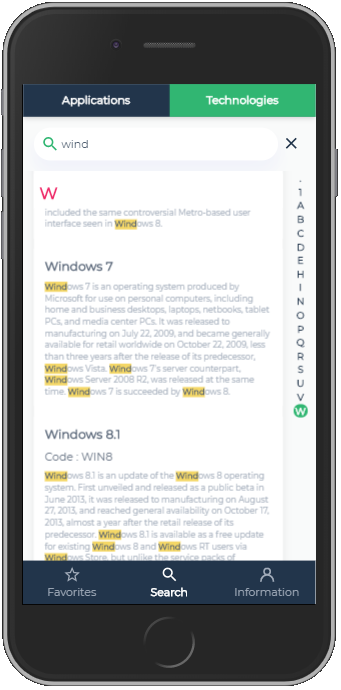
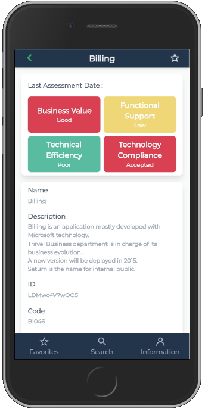
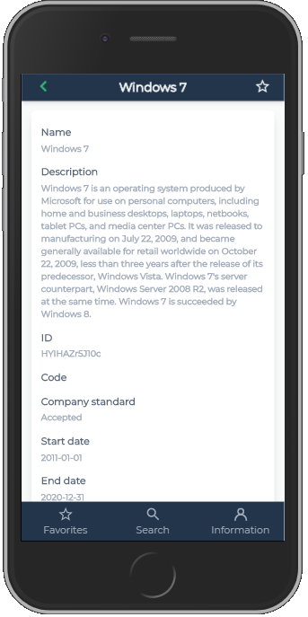

# Application ID Card

**Application ID Card** is a mobile application. It allows u to consult main data from Applications and Software technologies of an HOPEX repository.

- [Install and configure from **app-idcard.zip**](docs/deployment.md)
- [Configure build and deploy](docs/configure-build-deploy.md)
- [Application ID Card quick start guide](docs/readme.md)
- [Licence](LICENSE)

