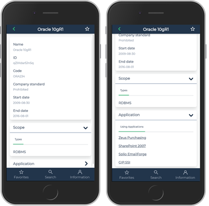

# App ID Card

**App ID Card** is a mobile application. It allows you to consult your application and technology inventories anywhere and on any device.

Using App ID Card it is possible to:

- Look for an application or a technology by searching a chain of character in its name, code or comment and consult its main characteristics.
- Navigate from an application to technologies it is using or from a technology to applications using it.
- Declare an application or a technology as a favorite to accelerate frequent consultation.

## Installation procedure

- [Install and configure from **app-idcard.zip**](docs/deployment.md)
- [Configure build and deploy](docs/configure-build-deploy.md)

## Documentation

- [Application ID Card quick start guide](docs/readme.md)

## Licence

- [Licence](LICENSE)
