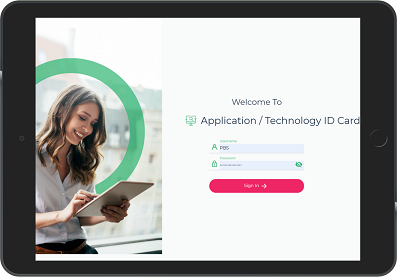
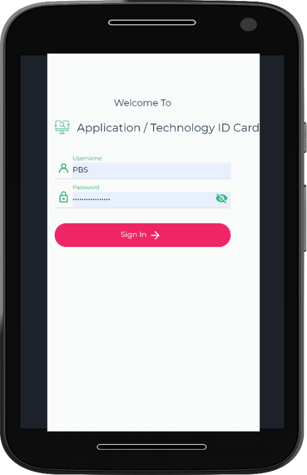

# App ID Card Quick Start Guide

**App ID Card** is a mobile component of HOPEX IT Portfolio Management. It enables anyone to consult application or technology inventory in a HOPEX repository.

 

## Sign In

After the [Installation of App ID Card], open **App ID Card** App or, with Google Chrome (for instance), browse to the **App ID Card** URL. The following login page opens.

Enter your **Username** and **Password** (the same as when in **HOPEX ITPM**) then tap **Sign In**. The Search page opens.
