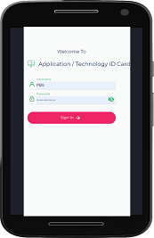
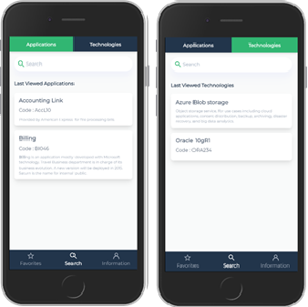
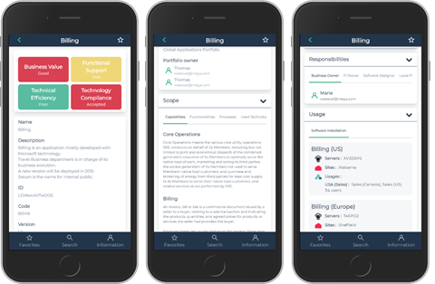

# App ID Card Quick Start Guide

**App ID Card** is a mobile component of HOPEX IT Portfolio Management. It enables anyone to consult application or technology inventory in a HOPEX repository.

 

## Sign In

After the [Installation of App ID Card], open **App ID Card** App or, with Google Chrome (for instance), browse to the **App ID Card** URL. The following login page opens.

  

Enter your **Username** and **Password** (the same as when in **HOPEX ITPM**) then tap **Sign In**. The Search page opens.

## Search

Search page presents 2 tabs : Application and Technology to select which asset you want to look for.

 
If you have already made some searches, the page presents the list of the last 15 consulted items.

## Application Search

To search for an application, start typing some characters in the search field. Those characters will be searched in the name, code, or comment of all applications if the repository.

Selecting an application in the result list will open application ID Card with different sections:
•	Application Main Characteristics
•	Scope (functional and technical)
•	Responsibility
•	Usage

Note : selecting a technology in the Scope section/used technology tab will open its ID Card.
